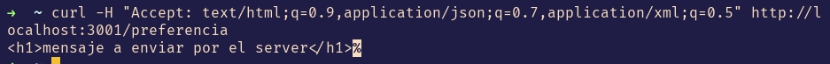

# negociación-de-contenido-http
Todos los endpoints se hicieron con express y aceptando archivos xml, JSON y html

## Petición de información


## Petición con preferencias


No hay modificación al código, solo a la consulta, agregando en el encabezado las preferencias

## Petición con control de cache


La configuración del uso de cache se hizo con el siguiente bloque, especificando el tiempo de vida y la hora en la que expira
```javascript
res.set({
    "Cache-Control": "public, max-age=60",
    "Expires": new Date(Date.now()+60000).toUTCString(),
  });
```

## Petición con etag


La creación del etag se hizo con la línea: `const etag = crypto.createHash("md5").update(json_response).digest("hex");`

Y el envío del código en caso de que no hayan cambios en el contenido con el bloque
```javascript
  if (req.header["if-none-match"]==etag) {
    return res.status(304).end();
  }
```
